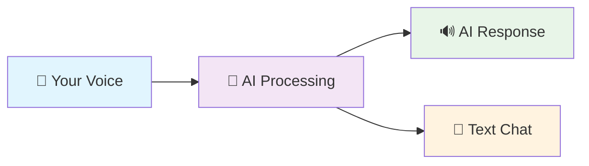
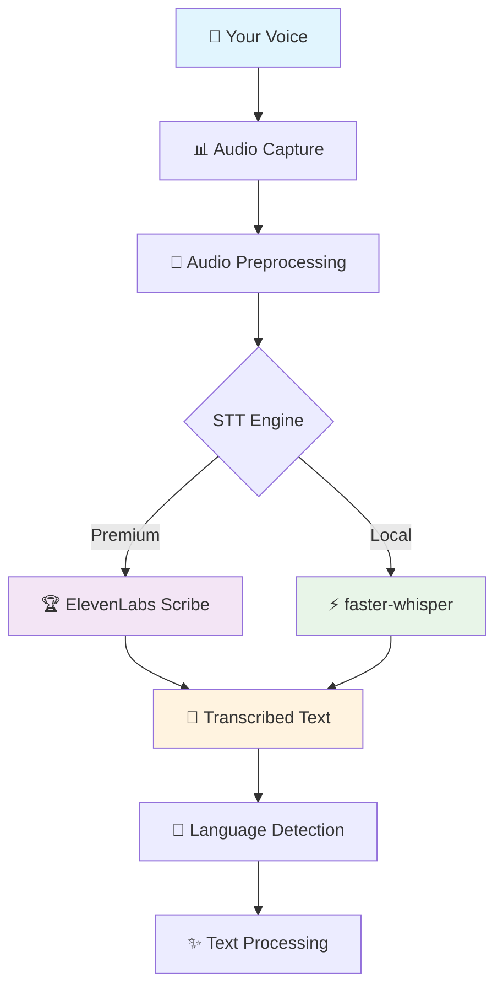
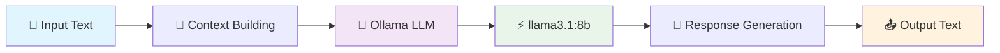
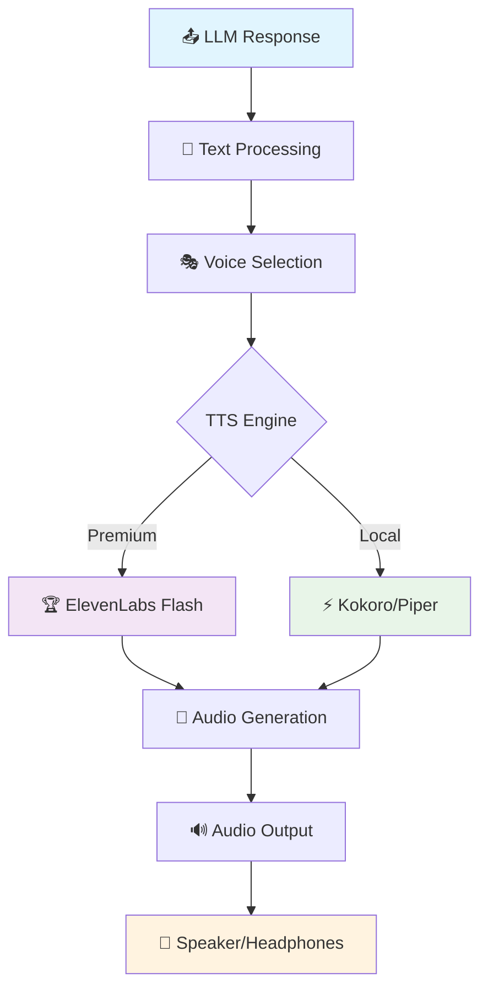
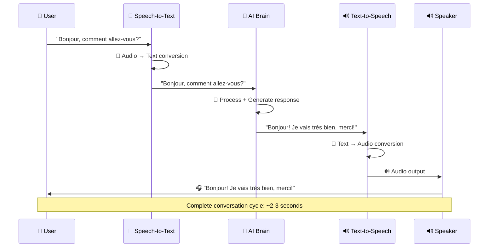
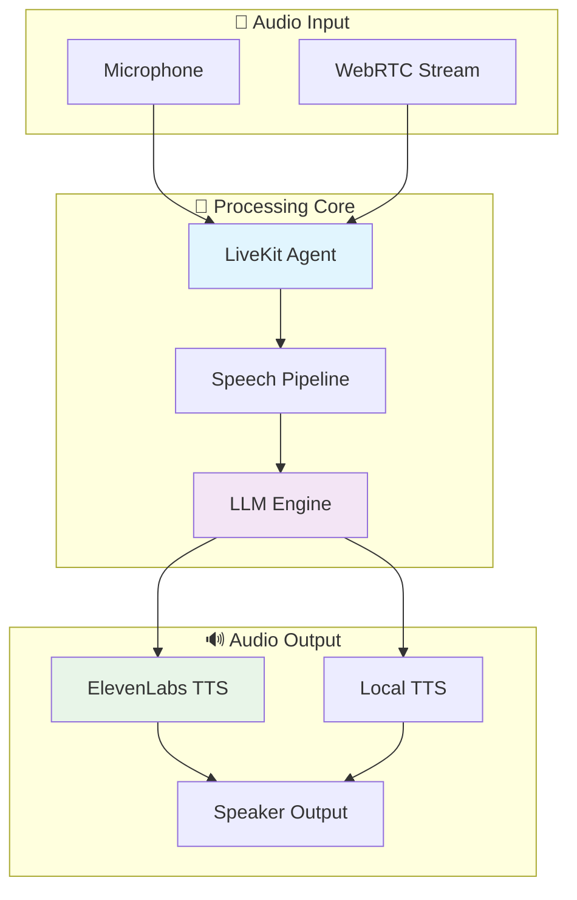

# 🎙️ LiveKit MVP Voice Agent

> **A Production-Ready Bilingual Voice Agent with Premium Audio Processing**
> 
> Transform text conversations into immersive voice experiences with AI-powered speech synthesis, local LLM reasoning, and real-time audio streaming.

<div align="center">

[](https://www.python.org/downloads/)
[](https://livekit.io/)
[](https://elevenlabs.io/)
[](https://ollama.ai/)

[🚀 Quick Start](#-quick-start) • [🎭 Demo Modes](#-demo-modes) • [🔧 How It Works](#-how-it-works) • [🌍 Languages](#-supported-languages)

</div>

---

## 🎯 What This Agent Does

Transform your conversations into intelligent voice interactions:



- **🎙️ Speak naturally** in English or French
- **🧠 Get intelligent responses** from local AI
- **🔊 Hear high-quality voice replies** via ElevenLabs
- **💬 Switch to text mode** anytime
- **🌍 Bilingual support** for language learning

---

## 🚀 Quick Start

### Prerequisites
- **Python 3.11+** 🐍
- **Docker Desktop** 🐳 (for full voice mode)
- **ElevenLabs API Key** 🔑 (for premium audio)

### Installation
```bash
git clone <your-repo>
cd LiveKit_MVP_Agent
make setup
```

---

## 🎭 Demo Modes

Choose your adventure! Each mode offers a different experience:

### 1. 🎪 **Interactive Voice Demo** 
> **What's happening behind the scenes:** ElevenLabs TTS + Mock conversations + Audio generation

```bash
cd elevenlabs_integration
uv run python voice_demo.py
```

**🎬 Experience:**
- Choose from 4 interactive options
- Generate real audio files
- Test different voices and languages
- Perfect for exploring TTS capabilities

**🔧 Tech Stack:**
- ✅ **TTS**: ElevenLabs `eleven_flash_v2_5` (premium quality)
- ✅ **Conversations**: Pre-scripted French learning scenarios
- ✅ **Audio**: Real MP3 generation for testing

---

### 2. 💬 **Text Chat Agent**
> **What's happening behind the scenes:** Local LLM processing + Simple text interface

```bash
make talk
```

**🎬 Experience:**
- Type messages, get AI responses
- Fast and lightweight
- Great for testing conversation logic
- No voice processing overhead

**🔧 Tech Stack:**
- ✅ **LLM**: Attempts Ollama connection, falls back to simple responses
- ✅ **Interface**: Clean terminal chat
- ✅ **Mode**: Text-only for quick interactions

---

### 3. 🎙️ **Full Voice Agent** (Complete Experience)
> **What's happening behind the scenes:** LiveKit WebRTC + Ollama LLM + ElevenLabs Audio + Real-time streaming

```bash
# Start the AI brain first
make start-ollama

# Launch the full voice agent
make run
```

**🎬 Experience:**
- Real-time voice conversations
- WebRTC audio streaming
- Complete AI pipeline
- Production-ready setup

**🔧 Tech Stack:**
- ✅ **STT**: faster-whisper (local speech recognition)
- ✅ **LLM**: Ollama with llama3.1:8b (local AI reasoning)
- ✅ **TTS**: ElevenLabs premium synthesis
- ✅ **Streaming**: LiveKit WebRTC for real-time audio

---

### 4. 🧪 **ElevenLabs Testing Suite**
> **What's happening behind the scenes:** API testing + Configuration validation + Audio generation

```bash
make test-elevenlabs
```

**🎬 Experience:**
- Validate your API key
- Test audio generation
- Check configuration
- Generate sample audio files

**🔧 Tech Stack:**
- ✅ **API**: Direct ElevenLabs testing
- ✅ **Config**: Environment variable validation
- ✅ **Audio**: Sample generation and playback

---

## 🔧 How It Works Under the Hood

### 🎤 **Speech-to-Text (STT) Pipeline**



**What happens:**
1. **🎤 Audio Capture**: Your microphone captures voice input
2. **📊 Preprocessing**: Audio is cleaned and formatted (16kHz, mono)
3. **🔄 STT Processing**: 
   - **Premium Mode**: ElevenLabs Scribe (99 languages, word timestamps)
   - **Local Mode**: faster-whisper (multilingual, offline)
4. **📝 Text Output**: "Hello, how are you?" 
5. **🧠 Language Detection**: Auto-detects English/French

---

### 🧠 **LLM Processing Pipeline**



**What happens:**
1. **📝 Input**: "Hello, how are you?"
2. **🔄 Context**: Conversation history + system prompts
3. **🧠 LLM Processing**: 
   - **Model**: llama3.1:8b-instruct (8 billion parameters)
   - **Processing**: Local inference via Ollama
   - **Languages**: Bilingual EN/FR support
4. **🎯 Generation**: AI crafts contextual response
5. **📤 Output**: "I'm doing great! How can I help you today?"

---

### 🔊 **Text-to-Speech (TTS) Pipeline**



**What happens:**
1. **📤 Text Input**: "I'm doing great! How can I help you today?"
2. **🔄 Processing**: Text cleanup, pronunciation optimization
3. **🎭 Voice Selection**:
   - **English**: Rachel (clear, friendly)
   - **French**: Charlotte (native accent)
4. **🎵 Audio Generation**:
   - **Premium**: ElevenLabs `eleven_flash_v2_5` (75ms latency)
   - **Local**: Kokoro or Piper TTS
5. **🔊 Output**: High-quality MP3 audio
6. **📱 Playback**: Through your speakers/headphones

---

## 🎛️ **Complete Voice Conversation Flow**



---

## 🎵 Audio Files & Testing

### Generated Audio Files
Your agent creates audio files you can play:

```bash
# Play generated audio samples
open voice_agent_test.mp3         # Latest TTS test
open conversation_1.mp3           # French learning demo
open env_test_output.mp3          # Environment test
```

### Audio Quality Comparison

| Mode | Engine | Quality | Latency | Cost | Languages |
|------|--------|---------|---------|------|-----------|
| 🏆 **Premium** | ElevenLabs Flash | Excellent | 75ms | Pay-per-use | 32 |
| ⚡ **Local** | faster-whisper + Kokoro | Good | 200ms | Free | 16 |
| 🔄 **Hybrid** | ElevenLabs TTS + Local STT | Best | 150ms | TTS only | 32 |

---

## 🌍 Supported Languages

### Primary Languages
- 🇺🇸 **English** - Native support, clear pronunciation
- 🇫🇷 **French** - Optimized for language learning

### Voice Presets
```bash
# English Voices
Rachel (EN-F) - Clear, friendly, professional
Adam (EN-M) - Deep, authoritative, warm

# French Voices  
Charlotte (FR-F) - Native French accent, educational
Antoine (FR-M) - Parisian accent, conversational
```

---

## 🔧 Configuration

### Environment Variables
Your `.env` file controls everything:

```bash
# 🔑 ElevenLabs (Premium Audio)
ELEVENLABS_API_KEY=sk_your_key_here
ELEVENLABS_TTS_MODEL=eleven_flash_v2_5  # Cost-optimized
ELEVENLABS_STT_MODEL=scribe_v1          # 99 languages

# 🧠 LLM (Local AI)
LLM_MODEL=llama3.1:8b-instruct-q4_K_M  # Main model
LLM_FALLBACK=mistral:7b-instruct-q4_K_M # Backup

# 🎙️ Audio Settings
SAMPLE_RATE=16000
CHANNELS=1
TTS_SPEED=1.0
```

### Cost Optimization
- **ElevenLabs TTS**: `eleven_flash_v2_5` (50% cheaper, 40K char limit)
- **Local STT**: faster-whisper (completely free)
- **Local LLM**: Ollama (completely free)
- **Result**: Premium audio quality at minimal cost! 💰

---

## 🎮 Interactive Commands

### Development Commands
```bash
make help           # 📋 Show all available commands
make setup          # 🛠️ Install dependencies  
make clean          # 🧹 Clean cache and temp files
make test           # ✅ Run test suite
```

### Voice Agent Commands
```bash
make talk           # 💬 Text chat mode
make run            # 🎙️ Full voice agent
make test-elevenlabs # 🧪 Test audio integration
```

### Docker & Models
```bash
make start-ollama   # 🐳 Start AI brain
make pull-model     # 📥 Download LLM
make stop-ollama    # 🛑 Stop AI brain
```

---

## 🏗️ Architecture

### System Components



### Technology Stack

| Layer | Technology | Purpose |
|-------|------------|---------|
| 🎤 **Audio I/O** | LiveKit WebRTC | Real-time audio streaming |
| 📝 **STT** | faster-whisper / ElevenLabs | Speech recognition |
| 🧠 **AI** | Ollama + llama3.1 | Local language understanding |
| 🔊 **TTS** | ElevenLabs Flash | Premium voice synthesis |
| 🌐 **Interface** | Python + AsyncIO | Real-time processing |
| 🐳 **Deployment** | Docker Compose | Container orchestration |

---

## 🎊 Fun Features

### 🎭 Voice Personalities
- **👩‍🏫 Teacher Mode**: Patient, educational responses
- **🤖 Assistant Mode**: Helpful, professional tone  
- **💬 Casual Mode**: Friendly, conversational style
- **🇫🇷 French Tutor**: Specialized for language learning

### 🎮 Interactive Elements
- **Real-time audio visualization** (coming soon)
- **Conversation history** with audio playback
- **Language switching** mid-conversation
- **Voice emotion detection** (experimental)

### 🏆 Achievement System
- 🥇 **First Conversation**: Complete your first voice chat
- 🇫🇷 **Polyglot**: Successfully switch between EN/FR
- 🎤 **Voice Master**: Generate 10+ audio responses
- 🤖 **AI Whisperer**: Have a 5+ turn conversation

---

## 🔍 Troubleshooting

### Common Issues

| Issue | Solution | Command |
|-------|----------|---------|
| 🐳 Docker not running | Start Docker Desktop | `make start-ollama` |
| 🔑 API key invalid | Check ElevenLabs dashboard | `make test-elevenlabs` |
| 🎤 No audio input | Check microphone permissions | Browser settings |
| 🧠 LLM not responding | Restart Ollama | `make stop-ollama && make start-ollama` |

### Debug Commands
```bash
make check-config   # 🔍 Validate configuration
make test          # ✅ Run full test suite  
make clean         # 🧹 Reset everything
```

---

## 🎯 Next Steps

1. **🚀 Start Simple**: Try `make talk` for text chat
2. **🎪 Explore Audio**: Run `voice_demo.py` for TTS testing  
3. **🎙️ Go Full Voice**: Use `make run` for complete experience
4. **🇫🇷 Learn Languages**: Practice French conversation
5. **🛠️ Customize**: Modify voices, models, and responses

---

## 📸 Screenshots & Demos

### Terminal Output Examples

**Voice Demo Menu:**
```
🎙️ ELEVENLABS VOICE AGENT DEMO
============================================================
Choose what you'd like to test:
1. 🗣️  Test TTS (Text-to-Speech)
2. 🤖 Demo Conversation with Voice  
3. 📋 Show Agent Capabilities
4. 🚀 All Tests
0. 🚪 Exit
```

**Conversation Flow:**
```
👤 You: Hello, can you help me practice French?
🤖 Agent: Bonjour! I'd be happy to help you practice French. 
          What would you like to work on today?
   🔊 Audio saved: conversation_1.mp3
```

---

<div align="center">

**🎉 Ready to chat with your AI voice agent? Pick a mode and start talking! 🎙️**

[🚀 Quick Start](#-quick-start) • [💬 Text Mode](#2--text-chat-agent) • [🎙️ Voice Mode](#3--full-voice-agent-complete-experience) • [🧪 Test Audio](#4--elevenlabs-testing-suite)

---

*Built with ❤️ using LiveKit, ElevenLabs, and Ollama*

</div>